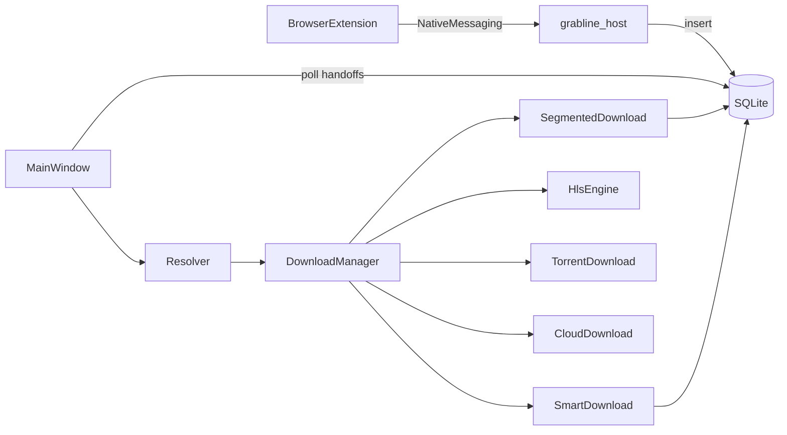

# GrabLine A to Z Learning Curriculum

A study path so you can understand GrabLine deeply enough to rebuild something like it yourself. Every path below exists in this repo. Prefer reading code and doing exercises over memorizing theory.

**No em dashes are used in this document on purpose (plain wording only).**

---

## Week 1 start here

Do these in order. Stop when a day feels full. Do not skip the explain-out-loud step.

1. Skim [README.md](../README.md) and [docs/security-model.md](security-model.md) once.
2. Create a venv, install deps (`pip install -e ".[dev]"`), run `python -m app` once.
3. Open [app/__main__.py](../app/__main__.py) and [app/core/models.py](../app/core/models.py). Write on paper: Job, Segment, Handoff, JobKind.
4. Trace one paste URL: [app/ui/main_window.py](../app/ui/main_window.py) → [app/core/resolver.py](../app/core/resolver.py) → [app/core/manager.py](../app/core/manager.py).
5. Read [app/db/database.py](../app/db/database.py) header comments about WAL. Find `jobs` and `segments` tables.
6. Run offline tests: `.venv/bin/python -m pytest app/tests/test_db.py app/tests/test_resolver.py -q`.
7. End of week checkpoint: explain to a friend (or a voice note) how a URL becomes a row in SQLite and then a running download.

Then continue from **Phase A** below at your chosen calendar pace.

---

## 0. How to use this curriculum

### Goal

Finish able to design and build a download manager with:

- multiple engines behind one router
- crash-safe resume
- a desktop UI
- a browser companion without open ports
- tests and a release pipeline

### How to study with Cursor

- Open one phase at a time. Ask Cursor: “Walk me through this file like I am new.”
- After each phase, close the chat and explain the flow from memory.
- When stuck, search the repo (`rg`) before guessing.
- Prefer reading tests: they show intended behavior without UI noise.

### When to pause and rebuild a mini clone

After Phase D, build Capstone 1-2. After Phase G, build Capstone 5. After Phase L, package Capstone 7. Mini clones lock learning in. Do not wait until the end of all phases.

### Calendars

| Pace | Weeks | Cadence |
| --- | --- | --- |
| Fast track | 4 | ~2 phases/week + short capstones on weekends |
| Normal | 8 to 10 | ~1 phase/week, Capstones interleaved |
| Deep | 12+ | Every phase + all 7 capstones + oral exam twice |

Suggested Normal mapping:

- Weeks 1-2: Prerequisites + Phases A-C
- Weeks 3-4: Phases D-E + Capstones 1-2
- Weeks 5-6: Phases F-G + Capstones 5-6
- Weeks 7-8: Phases H-J
- Weeks 9-10: Phases K-L + Capstones 3, 4, 7 + oral exam

---

## 1. Mental model (1 page)

GrabLine is a **desktop orchestrator**: a PySide6 shell owns settings and a SQLite database; a `DownloadManager` schedules work; a `Resolver` picks an engine for each URL; engines do the bytes (HTTP ranges, yt-dlp, FFmpeg HLS, libtorrent, cloud protocols). The browser never downloads for you. It only sends a handoff message through Native Messaging into SQLite. The UI polls that table and starts the same path as a pasted URL.



---

## 2. Prerequisites bootcamp

Only what this app needs. Each item points at a real file to open next.

### Python packages and modules

GrabLine is a package under `app/`. Entry is `python -m app` → [app/__main__.py](../app/__main__.py). Dependencies live in [pyproject.toml](../pyproject.toml) (PySide6, httpx, yt-dlp, libtorrent, keyring, …).

**Try:** `python -c "import app; print(app.__version__)"`

### HTTP Range requests

Direct downloads split a file into byte ranges (`Range: bytes=start-end`). Plan that logic in [app/core/downloader.py](../app/core/downloader.py) (`plan_segments`). Probe support in [app/core/probe.py](../app/core/probe.py).

**Try:** Read `plan_segments` and predict ranges for a 10 MB file with 4 connections.

### Threads vs processes vs Qt signals

- Engine work runs on Python threads inside `DownloadManager`.
- UI work stays on the Qt GUI thread.
- Cross-thread UI updates use signals / timers ([app/ui/work_threads.py](../app/ui/work_threads.py), [app/ui/threads.py](../app/ui/threads.py)).
- Native host is a **separate process** with stdio ([packaging/entry_host.py](../packaging/entry_host.py)).

### SQLite WAL basics

[app/db/database.py](../app/db/database.py) enables WAL so a kill mid-write does not corrupt the DB. Segment checkpoints make resume trustworthy.

### JSON protocols

Browser ↔ host messages: length-prefixed JSON in [app/native_host/protocol.py](../app/native_host/protocol.py). Job `options` are JSON blobs on the job row.

### Git branches and tags

- `dev`: full history, day to day work
- `main`: orphan single-commit tree for release and Pages
- Tags `v*`: trigger [.github/workflows/release.yml](../.github/workflows/release.yml)

**Try:** `git log main --oneline -3` and `git log dev --oneline -5`. Notice `main` has no parent chain like `dev`.

---

## 3. Phased learning path

---

### Phase A. Boot the app and find the spine

**Goal:** Know what starts, in what order, and where the window comes from.

**Concepts:** QApplication, single instance, settings load, manager construction, tray, timers.

**Files to read (ordered):**

1. [app/__main__.py](../app/__main__.py)
2. [app/core/paths.py](../app/core/paths.py)
3. [app/core/instance.py](../app/core/instance.py)
4. [app/core/settings.py](../app/core/settings.py) (skim API)
5. [app/core/manager.py](../app/core/manager.py) (class header + `__init__` only)
6. [app/ui/main_window.py](../app/ui/main_window.py) (`MainWindow.__init__` through timer setup)

**Walkthrough:** You run `python -m app`. `__main__.main` builds logging, QApplication, Settings, Database, DownloadManager, MainWindow. A single-instance lock may focus an existing window. Handoff timer starts at 250 ms. Tray may stay alive when the window closes.

**Exercise:** Add a temporary `log.info("spine ready")` just after `MainWindow` construction, run the app, confirm it appears, then remove it.

**Checkpoint questions:**

1. What is the public entry point?
2. Where does the DB file live on your OS?
3. Why does frozen install register a native host once?
4. What owns active downloads: the window or the manager?
5. What happens if a second GrabLine starts?

**What you should explain out loud:** Cold start from shell to visible window, naming the five objects that must exist.

**Vibe-code traps:** Putting download logic in the window; blocking the GUI thread on network I/O at startup.

---

### Phase B. Data model and persistence

**Goal:** Jobs and segments are the source of truth, not widgets.

**Concepts:** `JobKind`, `JobStatus`, segments, handoffs, queues, settings KV, WAL, single locked connection.

**Files to read (ordered):**

1. [app/core/models.py](../app/core/models.py)
2. [app/db/database.py](../app/db/database.py) (schema + `add_job` / segment helpers / handoffs)
3. [app/tests/test_db.py](../app/tests/test_db.py)

**Walkthrough:** A new direct job inserts a `jobs` row and segment rows. Workers update `downloaded` on segments. On crash, WAL + checkpoints let resume continue from disk `.gl-part` plus segment state. Extension URLs become `handoffs` rows until claimed.

**Exercise:** Run `pytest app/tests/test_db.py -q`. Then in a Python REPL open the DB path from `paths` and `SELECT` table names.

**Checkpoint questions:**

1. Name all `JobKind` values and which module runs each.
2. What is `PART_SUFFIX`?
3. Why WAL?
4. What is a `Handoff`?
5. Direct vs smart: where does progress live?

**What you should explain out loud:** How resume works after `kill -9` at the DB level.

**Vibe-code traps:** Storing progress only in UI memory; multiple SQLite connections without a lock; treating handoffs as optional glue instead of the bridge.

---

### Phase C. URL resolver

**Goal:** One function decides the engine. Honest refusals beat cryptic crashes.

**Concepts:** DRM blocklist, smart site match, HLS manifests, probe/direct, cloud/torrent schemes, “nothing to download”.

**Files to read (ordered):**

1. [app/core/resolver.py](../app/core/resolver.py)
2. [app/core/cloudlinks.py](../app/core/cloudlinks.py) (skim)
3. [app/tests/test_resolver.py](../app/tests/test_resolver.py)
4. [docs/security-model.md](security-model.md) boundaries B3 / B7

**Walkthrough:** Paste `https://www.netflix.com/...` → DRM refusal message, no job. Paste a `.m3u8` → HLS variants. Paste a normal file URL → probe → DIRECT. Paste a YouTube URL → SMART with media info for the quality panel.

**Exercise:** Pick three URLs (file, YouTube, Netflix). Mentally predict `Resolution.kind`. Confirm by reading tests or calling `Resolver.resolve` in a small script.

**Checkpoint questions:**

1. Where are DRM services listed?
2. What is `Resolution`?
3. When does smart win over direct?
4. Why refuse DRM up front?
5. How do Drive/Dropbox share links enter the pipeline?

**What you should explain out loud:** The ordered decision tree of `Resolver.resolve`.

**Vibe-code traps:** Calling yt-dlp for every URL; swallowing errors into empty UI; downloading HTML pages as files without a friendly message.

---

### Phase D. Direct segmented downloader

**Goal:** Understand the heart of “fast download manager.”

**Concepts:** Probe, range workers, dynamic steal, checkpointer, `.gl-part`, rename to final, rate limits.

**Files to read (ordered):**

1. [app/core/probe.py](../app/core/probe.py)
2. [app/core/downloader.py](../app/core/downloader.py) (`plan_segments`, `SegmentedDownload.run`, checkpointer)
3. [app/core/ratelimit.py](../app/core/ratelimit.py) (skim)
4. [app/core/net.py](../app/core/net.py) (skim TLS / proxy helpers)
5. [app/tests/test_downloader.py](../app/tests/test_downloader.py)
6. [app/tests/test_crash_resume.py](../app/tests/test_crash_resume.py)

**Walkthrough:** Manager starts `SegmentedDownload`. Probe learns size and range support. Segments planned. Workers fetch ranges into one `.gl-part`. Checkpoints hit SQLite after bytes are on disk. On complete, part file renames to final name via naming sanitization.

**Exercise:** Read `plan_segments` and sketch the ranges. Run `pytest app/tests/test_downloader.py -q`.

**Checkpoint questions:**

1. What if the server ignores Range?
2. Why checkpoint after disk write, not before?
3. What is dynamic steal?
4. Where do speed caps apply?
5. How does pause differ from cancel?

**What you should explain out loud:** Crash-safe resume in four steps (probe, plan, checkpoint, rename).

**Vibe-code traps:** Updating DB before writing bytes; assuming every server supports ranges; putting 32 connections on tiny files blindly.

---

### Phase E. DownloadManager and queues

**Goal:** Scheduling is a product feature, not an afterthought.

**Concepts:** JobView, concurrency slots, named queues, schedules (including midnight wrap), dependencies, retries, fair speed.

**Files to read (ordered):**

1. [app/core/manager.py](../app/core/manager.py) (`DownloadManager`, `_kick`, `_pass`, `_start_job`, `add_*`)
2. [app/ui/queue_view.py](../app/ui/queue_view.py) (skim UI for queues)
3. [app/tests/test_manager.py](../app/tests/test_manager.py)
4. [app/tests/test_queues.py](../app/tests/test_queues.py)
5. [app/tests/test_scheduler_features.py](../app/tests/test_scheduler_features.py)
6. [app/tests/test_scheduler_extras.py](../app/tests/test_scheduler_extras.py)

**Walkthrough:** `add_url` / `add_smart` inserts a job. Scheduler loop sees a free slot, respects queue schedule and “wait for other queue”, starts a task thread. Fair speed may probe then share bandwidth. Transient errors retry; permanent ones stay failed.

**Exercise:** In Queue manager UI (or tests), explain how a “Games only 00:00-06:00 after movies” queue is represented in DB fields.

**Checkpoint questions:**

1. Who calls `_create_task`?
2. What makes an error transient?
3. How does fair speed avoid lock-low shares?
4. What is `JobView` for?
5. Where is per-job connection count stored?

**What you should explain out loud:** From “Queued” to “Downloading” including schedule gates.

**Vibe-code traps:** Starting unlimited threads; retrying DRM/auth forever; putting schedule logic only in the UI.

---

### Phase F. Smart / yt-dlp engine and quality UI

**Goal:** Video/audio is a curated UX over yt-dlp, not a raw CLI dump.

**Concepts:** inspect vs download, format curation, quality panel, cookies/session, JS runtime (Deno), prefetch/cache, playlists.

**Files to read (ordered):**

1. [app/engines/smart.py](../app/engines/smart.py) (`SmartEngine.inspect`, `curate_formats`, `SmartDownload`, prefetch helpers)
2. [app/ui/quality_panel.py](../app/ui/quality_panel.py)
3. [app/ui/work_threads.py](../app/ui/work_threads.py) (`ResolveThread` stays JS-less)
4. [app/core/jsruntime.py](../app/core/jsruntime.py) (skim)
5. [app/core/ffmpeg.py](../app/core/ffmpeg.py) (why merge needs FFmpeg)
6. [app/tests/test_curation.py](../app/tests/test_curation.py)
7. [app/tests/test_smart_download.py](../app/tests/test_smart_download.py)

**Walkthrough:** Paste YouTube → resolve → JS-less inspect → QualityPanel. Prefetch of cookies+runtime starts **after** analysis (see main window `_on_resolved`), overlapping folder/quality UI. Confirm → `add_smart` → `SmartDownload` waits for prefetch (no short timeout that double-extracts) → yt-dlp download + merge.

**Exercise:** Explain why analyze must not call `prefetch_download_ready` inside `ResolveThread` (performance lesson from v1.29.18).

**Checkpoint questions:**

1. What is format curation for?
2. When do cookies get attached?
3. Why Deno/JS runtime?
4. Difference between `recall_info` and `recall_download_ready`?
5. What happens without FFmpeg on separate A/V formats?

**What you should explain out loud:** Fast analyze vs slow download-ready path, and how Confirm stays warm.

**Vibe-code traps:** Forcing cookies+runtime on every analyze; showing raw yt-dlp format lists in the UI; ignoring bot checks until users complain.

---

### Phase G. Browser extension + native host bridge

**Goal:** Browser and app talk without sockets or localhost servers.

**Concepts:** MV3 extension, content scripts, hover buttons, download takeover, Native Messaging framing, host validation, handoffs table, dual binaries.

**Files to read (ordered):**

1. [extension/README.md](../extension/README.md)
2. [extension/manifest.json](../extension/manifest.json)
3. [extension/background.js](../extension/background.js) (send to host)
4. [extension/content/overlay.js](../extension/content/overlay.js) (skim hover path)
5. [extension/content/sites/youtube.js](../extension/content/sites/youtube.js) (one site script)
6. [app/native_host/protocol.py](../app/native_host/protocol.py)
7. [app/native_host/host.py](../app/native_host/host.py)
8. [app/native_host/install.py](../app/native_host/install.py)
9. [app/ui/main_window.py](../app/ui/main_window.py) (`_poll_handoffs`, `_drain_handoffs`)
10. [app/tests/test_native_host.py](../app/tests/test_native_host.py)
11. [packaging/entry_host.py](../packaging/entry_host.py) + note in [packaging/README.md](../packaging/README.md)

**Walkthrough:** User clicks GrabLine on a video. Extension sends JSON over Native Messaging. Host validates scheme/headers/size, inserts `handoffs`. GUI timer claims rows and runs resolve/queue. Progress pill can ask host → DB by URL. Windows needs a **console** host exe because GUI apps have no stdio.

**Exercise:** Draw the path on paper: click → background.js → host.py → SQLite → MainWindow. Label each trust check from security-model B2.

**Checkpoint questions:**

1. Wire format of one message?
2. Max message size?
3. Why not a localhost HTTP server?
4. Why two frozen binaries?
5. What sources can a handoff have?

**What you should explain out loud:** End to end browser → file on disk, naming every hop.

**Vibe-code traps:** Letting the extension download the file itself; trusting page-supplied filenames; forgetting CRLF stripping on headers.

---

### Phase H. HLS, torrent, cloud engines

**Goal:** Same job model, different transports.

**Concepts:** Manifest parse, FFmpeg protocol lockdown, shared libtorrent session, magnets, cloud protocols, keyring secrets, share-link rewrite.

**Files to read (ordered):**

1. [app/engines/manifest.py](../app/engines/manifest.py)
2. [app/engines/hls.py](../app/engines/hls.py)
3. [app/engines/torrent.py](../app/engines/torrent.py)
4. [app/engines/cloud.py](../app/engines/cloud.py)
5. [app/core/credentials.py](../app/core/credentials.py)
6. [app/core/cloudlinks.py](../app/core/cloudlinks.py)
7. Tests: [app/tests/test_hls.py](../app/tests/test_hls.py), [app/tests/test_torrent.py](../app/tests/test_torrent.py), [app/tests/test_cloud.py](../app/tests/test_cloud.py)

**Walkthrough (HLS):** Resolver sees master playlist → variants → user picks → HLS engine may fetch segments itself, rewrite to local paths, run FFmpeg with allow-listed protocols only.

**Walkthrough (torrent):** Magnet → shared `SESSION` → `TorrentDownload` maps pause/cancel onto GrabLine statuses.

**Walkthrough (cloud):** `sftp://` with keyring creds → ranged/seek resume into `.gl-part` pattern where supported.

**Exercise:** In [docs/security-model.md](security-model.md), find the FFmpeg protocol rule. Match it to a line in `hls.py` or related helpers.

**Checkpoint questions:**

1. Why rewrite HLS manifests locally?
2. Why one libtorrent session for the process?
3. Where do SFTP passwords live?
4. What does `cloudlinks` do before engines?
5. How do cloud jobs show progress without HTTP segments?

**What you should explain out loud:** One job row, three engines, why security differs for FFmpeg vs HTTP.

**Vibe-code traps:** Passing remote playlist URLs straight into unlocked FFmpeg; creating a torrent session per job; logging secrets.

---

### Phase I. UI architecture

**Goal:** The window is a view over manager + DB, with careful threading.

**Concepts:** Main window refresh loop, detail drawer, dashboard graphs, dialogs, theme/design tokens, QThread lifetime, shutdown order.

**Files to read (ordered):**

1. [app/ui/main_window.py](../app/ui/main_window.py) (structure: add URL, refresh, shutdown)
2. [app/ui/detail_drawer.py](../app/ui/detail_drawer.py) (skim)
3. [app/ui/dashboard_view.py](../app/ui/dashboard_view.py) + [app/ui/components.py](../app/ui/components.py) graphs
4. [app/ui/theme.py](../app/ui/theme.py), [app/ui/design.py](../app/ui/design.py)
5. [app/ui/work_threads.py](../app/ui/work_threads.py), [app/ui/threads.py](../app/ui/threads.py), [app/ui/guard.py](../app/ui/guard.py)
6. [app/tests/test_ui_smoke.py](../app/tests/test_ui_smoke.py) (sample a few tests)
7. [app/tests/test_thread_lifetime.py](../app/tests/test_thread_lifetime.py)

**Walkthrough:** Timer refreshes rows from `manager.views()`. Opening quality uses `ResolveThread` so analyze does not freeze UI. Shutdown stops timers, then workers, then manager, then DB.

**Exercise:** Find where the handoff timer interval is set (250 ms). Find where refresh timer is set. Note why handoff drain guards re-entrancy.

**Checkpoint questions:**

1. Why parent QThreads?
2. What is `guard` for?
3. Where do status pills get their color?
4. How does the dashboard get speed samples?
5. What is the shutdown order?

**What you should explain out loud:** Why “download finished” must not be implemented only as a widget state change.

**Vibe-code traps:** Calling yt-dlp on the GUI thread; destroying a running QThread; nesting modal dialogs without handoff guards.

---

### Phase J. Security, privacy, networking

**Goal:** Know what is enforced vs advisory, and why.

**Concepts:** Trust boundaries, filename sanitization, archive escape, shell=True ban, TLS always on, privacy (no telemetry), optional browser session cookies stay local.

**Files to read (ordered):**

1. [docs/security-model.md](security-model.md) (full)
2. [PRIVACY.md](../PRIVACY.md)
3. [SECURITY.md](../SECURITY.md)
4. [app/core/naming.py](../app/core/naming.py)
5. [app/core/archive.py](../app/core/archive.py) (escape guards)
6. [app/core/security.py](../app/core/security.py), [app/core/virusscan.py](../app/core/virusscan.py), [app/core/reputation.py](../app/core/reputation.py) (advisory)
7. [app/core/net.py](../app/core/net.py)

**Walkthrough:** Malicious `Content-Disposition` filename with `../` → sanitized. Zip slip member → refused. VirusTotal hit → warning only, file kept. Extension sends `file://` → host rejects.

**Exercise:** Write five malicious filenames. Predict `sanitize_filename` output by reading the function.

**Checkpoint questions:**

1. Advisory vs enforced: one example each.
2. Why never `shell=True`?
3. What does GrabLine not defend against?
4. Are cookies uploaded to GrabLine servers?
5. What is boundary B2?

**What you should explain out loud:** The one principle from the security model in your own words.

**Vibe-code traps:** Blocking downloads on AV warnings; disabling TLS to “fix” a site; trusting extension input because “it is our extension.”

---

### Phase K. Tests and how to change code safely

**Goal:** Change GrabLine without fear.

**Concepts:** pytest layout, media server fixtures, offscreen Qt, network marker skipped in CI, ruff/mypy, writing a regression test first.

**Files to read (ordered):**

1. [pyproject.toml](../pyproject.toml) pytest/ruff/mypy sections
2. [app/tests/conftest.py](../app/tests/conftest.py)
3. [app/tests/media_server.py](../app/tests/media_server.py)
4. [.github/workflows/ci.yml](../.github/workflows/ci.yml)
5. Pick one engine test file you already know and read it end to end

**Walkthrough:** You fix a prefetch bug. You add a unit test that fails first, implement fix, run ruff format/check, push. CI runs the same gates.

**Exercise:** Run:

```bash
.venv/bin/ruff check app/core/resolver.py
.venv/bin/python -m pytest app/tests/test_resolver.py -q
```

**Checkpoint questions:**

1. What does `@pytest.mark.network` mean in CI?
2. Why a local `MediaServer`?
3. Where is line length configured?
4. Why is UI mypy relaxed vs core?
5. What is the first test you write for a bug?

**What you should explain out loud:** Your personal checklist before pushing to `dev`.

**Vibe-code traps:** “It works on my machine” without tests; formatting only in the IDE while CI uses ruff; huge UI tests for a pure logic bug.

---

### Phase L. Packaging, CI, orphan main releases, website

**Goal:** Ship installers and a landing page like a real product.

**Concepts:** PyInstaller dual entry, Inno/AppImage/DMG, tag-driven release, Pages deploy from `main`, orphan commit message = version, extension zip script.

**Files to read (ordered):**

1. [packaging/README.md](../packaging/README.md)
2. [packaging/grabline.spec](../packaging/grabline.spec) (skim)
3. [packaging/entry_gui.py](../packaging/entry_gui.py), [packaging/entry_host.py](../packaging/entry_host.py)
4. [.github/workflows/release.yml](../.github/workflows/release.yml)
5. [.github/workflows/pages.yml](../.github/workflows/pages.yml)
6. [.github/workflows/ci.yml](../.github/workflows/ci.yml)
7. [website/index.html](../website/index.html) (head meta + hero)
8. [scripts/package_extension.py](../scripts/package_extension.py)
9. [docs/install.md](install.md)

**Walkthrough (release):** Work on `dev` → bump version in `app/__init__.py`, `pyproject.toml`, `extension/manifest.json`, website `softwareVersion` → commit “Release x.y.z: …” → orphan commit on temp branch with message `x.y.z` → point `main` there → tag `vx.y.z` → push `dev`, force-push `main`, push tag → Actions builds assets → Pages updates site.

**Exercise:** Without pushing, rehearse the commands on paper. Confirm which four files carry the version string.

**Checkpoint questions:**

1. Why is `grabline-host` separate?
2. What triggers a GitHub Release?
3. Why orphan `main`?
4. Where do OG preview tags live?
5. What does `package_extension.py` produce?

**What you should explain out loud:** Your release checklist from version bump to installers on the Releases page.

**Vibe-code traps:** Tagging `dev` history for Pages; shipping one binary that breaks Native Messaging on Windows; forgetting to bump extension version with the app.

---

## 4. Capstone rebuild ladder

Build these in a **separate folder**, not inside GrabLine. Then map each back.

| # | Mini project | Maps to GrabLine |
| --- | --- | --- |
| 1 | One-connection downloader that resumes with a `.part` file and a tiny SQLite `bytes` column | `downloader` simplified + `database` |
| 2 | Multi-connection Range downloader + `plan_segments` + checkpoints | `SegmentedDownload`, `probe` |
| 3 | Tiny PySide6 table that lists jobs and polls SQLite every 0.5s | `main_window` refresh pattern |
| 4 | URL router: `magnet:` → print “torrent”; `.m3u8` → “hls”; else “direct” | `resolver` |
| 5 | CLI “fake extension”: write a handoff row; GUI polls and shows a popup | `native_host` + handoffs (skip real NM at first) |
| 6 | Script: `yt-dlp` extract formats → print a 5-row quality ladder → download one | `smart` curation + quality panel idea |
| 7 | Freeze a hello PySide window with PyInstaller; optional second console script | `grabline.spec` dual entry lesson |

Done when you can point at GrabLine files and say “this is the production version of my capstone N.”

---

## 5. Explain it like a teammate (oral exam)

Answer out loud without looking. Then verify in code.

1. What starts when someone runs `python -m app`?
2. Where is persistent state stored?
3. Name all job kinds and engines.
4. How does crash-safe resume work for direct downloads?
5. What does the resolver refuse before trying engines?
6. Why is analyze JS-less for YouTube?
7. When does GrabLine attach browser cookies?
8. How does the extension deliver a URL without ports?
9. Describe Native Messaging framing.
10. Why two executables in the installer?
11. What is an orphan `main` release?
12. How do named queues and schedules gate starts?
13. What is fair speed trying to fix?
14. How does HLS avoid FFmpeg reading arbitrary local files?
15. Where do SFTP secrets live?
16. Advisory vs enforced security: define both.
17. What is a handoff source `gallery` for?
18. How does the UI learn progress without blocking?
19. What CI checks run on every push?
20. Which files must bump for a version release?
21. What is `PART_SUFFIX`?
22. Why WAL mode?
23. How do Drive share links become downloads?
24. What happens on second app instance launch?
25. Walk browser click → completed file in one continuous story.

Score yourself: 20+ solid means you are ready to build a sibling project. Below 15: revisit the weak phases and their tests.

---

## 6. Cheat sheet

### Everyday commands

```bash
cd /home/zain/projects/Grabline
python3 -m venv .venv
.venv/bin/pip install -e ".[dev]"
.venv/bin/python -m app
.venv/bin/python -m pytest app/tests -q -m "not network"
.venv/bin/ruff check app
.venv/bin/ruff format app
.venv/bin/python scripts/package_extension.py
```

### Key paths

| Path | Why it matters |
| --- | --- |
| [app/__main__.py](../app/__main__.py) | Process entry |
| [app/core/models.py](../app/core/models.py) | Job/segment/handoff types |
| [app/db/database.py](../app/db/database.py) | SQLite + WAL |
| [app/core/resolver.py](../app/core/resolver.py) | Engine routing |
| [app/core/downloader.py](../app/core/downloader.py) | Segmented HTTP |
| [app/core/manager.py](../app/core/manager.py) | Scheduler |
| [app/engines/smart.py](../app/engines/smart.py) | yt-dlp UX |
| [app/native_host/](../app/native_host/) | Browser bridge |
| [extension/](../extension/) | GrabLine Connect |
| [packaging/](../packaging/) | Freeze + installers |
| [.github/workflows/](../.github/workflows/) | CI / release / Pages |
| [website/index.html](../website/index.html) | Landing + OG tags |
| [docs/security-model.md](security-model.md) | Threat model |

### Runtime spine (memory card)

```text
UI / handoff / paste
  -> Resolver
  -> DownloadManager.add_*
  -> engine task thread
  -> SQLite progress
  -> UI refresh timer
```

### Release memory card

```text
dev commit (Release x.y.z: …)
  -> orphan main commit message "x.y.z"
  -> tag vx.y.z
  -> push dev, force-push main, push tag
  -> Actions builds installers
```

### Version bump files

- [app/__init__.py](../app/__init__.py)
- [pyproject.toml](../pyproject.toml)
- [extension/manifest.json](../extension/manifest.json)
- [website/index.html](../website/index.html) (`softwareVersion`)

---

## Corrections to the master prompt facts

Verified against the repo while writing this curriculum:

- Stack and engines match [pyproject.toml](../pyproject.toml) and `app/engines/`.
- Handoff poll interval is **250 ms** in [app/ui/main_window.py](../app/ui/main_window.py).
- Analyze must stay JS-less in [app/ui/work_threads.py](../app/ui/work_threads.py); prefetch starts after resolve in the UI path.
- Dual binaries and Windows stdio reason are documented in [packaging/README.md](../packaging/README.md).
- Security principle “advisory vs enforced” is the spine of [docs/security-model.md](security-model.md).

No major prompt facts were wrong; details above are the precise anchors to learn from.

---

## Next action

Start **Week 1 start here** today. When Week 1 is done, open Phase A and do not skip the out-loud explanation. That habit matters more than reading speed.
